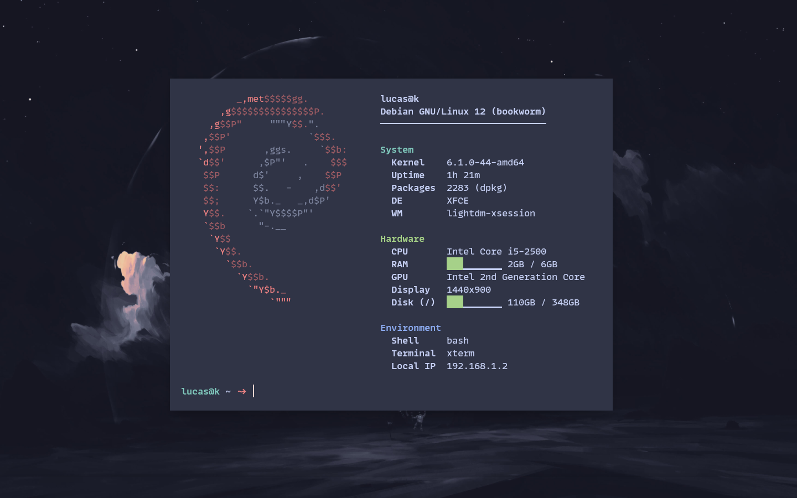

<p align="center">

</p>

[](https://github.com/lucaas-d3v/awesome-flint)

# ffetch

ffetch is a fast and minimal system information tool for the terminal written in [Flint](https://github.com/lucaas-d3v/flint).

It displays information about your system next to a distro ASCII logo,
similar to neofetch and fastfetch — but written entirely in Flint.

## Features

- Extremely fast startup (~0.01s)
- Clean and minimal UI
- ASCII distro logos
- RAM usage bar
- Hardware and environment information
- Written entirely in [Flint](https://github.com/lucaas-d3v/flint)

## Performance

| Command | Mean [ms] | Min [ms] | Max [ms] | Relative |
|:---|---:|---:|---:|---:|
| `ffetch` | 10.6 ± 0.3 | 10.2 | 11.4 | 1.00 |
| `neofetch` | 278.9 ± 4.5 | 264.2 | 289.6 | 26.33 ± 0.96 |
| `fastfetch` | 31.5 ± 0.5 | 30.3 | 33.4 | 2.98 ± 0.11 |

## Installation

Requeriments:

- [flint](https://github.com/lucaas-d3v/flint) (Flint v1.10.0)

```bash
git clone https://github.com/lucaas-d3v/ffetch
cd ffetch
./install.sh
```

## Usage

```bash
ffetch
```

### Options

```bash
ffetch --help
ffetch --version
ffetch --no-logo
```

## Example

> Is this example a real output that was run on my machine

```text
       _,met$$$$$gg.             lucas@k
    ,g$$$$$$$$$$$$$$$P.          Debian GNU/Linux 12 (bookworm)
  ,g$$P"     """Y$$.".           ──────────────────────────────
 ,$$P'              `$$$.        
',$$P       ,ggs.     `$$b:      System
`d$$'      ,$P"'   .    $$$        Kernel    6.1.0-44-amd64
 $$P      d$'     ,    $$P         Uptime    2h 1m
 $$:      $$.   -    ,d$$'         Packages  2282 (dpkg)
 $$;      Y$b._   _,d$P'           DE        XFCE
 Y$$.    `.`"Y$$$$P"'              WM        lightdm-xsession
 `$$b      "-.__                 
  `Y$$                           Hardware
   `Y$$.                           CPU       Intel Core i5-2500
     `$$b.                         RAM       ██████▁▁▁▁ 4GB / 6GB
       `Y$$b.                      GPU       Intel 2nd Generation Core
         `"Y$b._                   Display   1440x900
             `"""                  Disk (/)  ███▁▁▁▁▁▁▁ 110GB / 348GB
                                 
                                 Environment
                                   Shell     bash
                                   Terminal  xterm
                                   Local IP  192.168.1.2
```

---

## Final Considerations

Final experimental release
Used to test Flint stdlib and runtime performance

This projected si finished on Flint v1.10.0

> ffetch is not just a fetch tool. It's proof that [flint](https://github.com/lucaas-d3v/flint/blob/dev/) can build real software.
